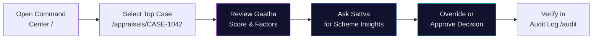
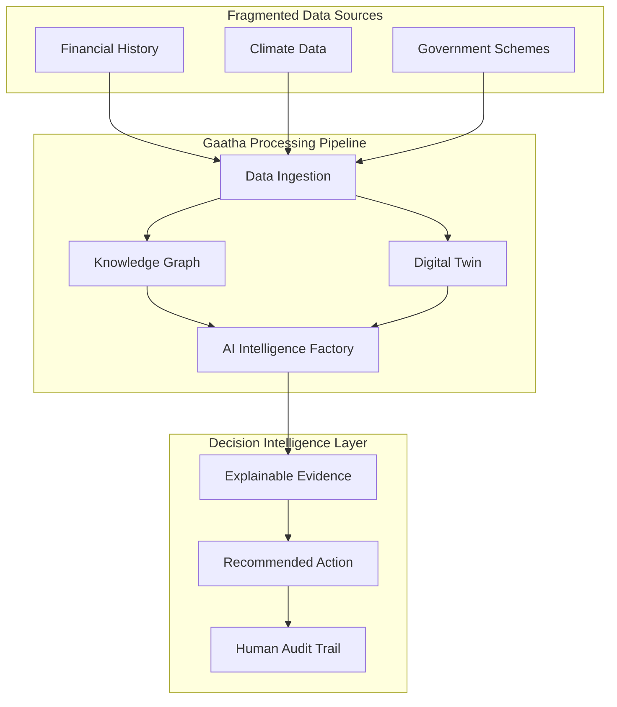

<div align="center">

# GAATHA

**Prediction → Decision → Explainability → Action**

A decision-intelligence platform that turns fragmented rural economic signals into actionable credit recommendations - cash flow forecasting, knowledge graph reasoning, explainable AI, and a human-in-the-loop audit trail, end to end.

<br/>

[](#)
[](#)
[](LICENSE)

[](https://react.dev/)
[](https://vitejs.dev/)
[](#)
[](#)

</div>

---

> **Every decision recommendation is backed by cited evidence and a confidence score - never a black-box output.**
> The platform speaks in `Gaatha Score`, confidence intervals, and explainable factors, ensuring that rural lending remains transparent and accountable.

> **Note on architecture.** This prototype is built as a zero-dependency, deterministic environment to guarantee a flawless demo experience. The data layer is fully local (`src/services/api.js`), mocking realistic latency and states without requiring an active backend.

---

## Table of contents

- [Overview](#overview) · [Why this is different](#why-this-is-different) · [The core interface](#the-core-interface)
- [Product walkthrough](#product-walkthrough) · [Interactive demo](#interactive-demo)
- [System architecture](#system-architecture) · [Repository structure](#repository-structure)
- [Technology stack](#technology-stack)
- [Installation](#installation) · [Running](#running)
- [Future roadmap](#future-roadmap)
- [Acknowledgements](#acknowledgements) · [License](#license)

---

## Overview

Traditional rural credit relies on fragmented data, manual processes, and isolated insights. Field officers face immense challenges when assessing unbanked micro-enterprises due to sparse data and delayed interventions, leading to rejected credit applications.

Most hackathon submissions answer *"build a dashboard."* Gaatha answers *"build an operating system."* The unit of output is not just a chart; it is a **decision with a confidence level**. Gaatha replaces static reporting with dynamic Decision Intelligence, providing step-by-step coaching for micro-enterprises and a copilot for field officers.

---

## Why this is different

Existing work stops at prediction. Gaatha drives that prediction through every downstream decision.

| | Traditional Dashboards | **Gaatha (RFI-OS)** |
|---|---|---|
| Objective | Prediction only | **Decision Intelligence** |
| Explainability | Black box | **Explainable (XAI)** - every factor has cited evidence |
| Scope | Single enterprise | **Village Knowledge Graph** - interconnected community factors |
| Connectivity | Online only | **Offline First** - designed for low-connectivity environments |
| Output | Risk score | **Action Recommendation** - clear next steps |
| Initiation | No cold start | **Cold Start Intelligence** - works with sparse initial data |
| Growth | No coaching | **Credit Readiness Journey** - guides unbanked enterprises |

---

## The core interface

The single most important view. The Command Center consolidates portfolio health, the AI-ranked decision queue, and climate alerts into a single actionable surface.

*The Command Center provides a real-time visualization of the loan portfolio health, flags at-risk micro-enterprises based on emerging climate data, and offers an AI-prioritized queue of cases requiring loan officer review.*

> **No hidden logic.** The system forces human review before any final action is taken, logging the interaction in a permanent audit trail.

---

## Product walkthrough

The platform is built as a highly responsive single-page application. Each view is designed for clarity and speed.

### 1 - Command Center `/`

The operational status board. View portfolio health, climate alerts, and the prioritized decision queue.

### 2 - Credit Appraisal `/appraisals/:id`

The deep dive into a specific case. Review the Gaatha Score, the weighted factors (repayment discipline, climate exposure, scheme uplift), and the evidence layer.

### 3 - Field Officer Copilot (Sattva)

An integrated AI assistant providing scheme eligibility insights and real-time guidance directly within the appraisal context.

### 4 - Audit Log `/audit`

The permanent record. Every decision, AI recommendation, and human override is captured with timestamps and reasoning.

---

## Interactive demo

A complete session, the way a loan officer would run it:



1. **Open** `npm run dev` → `http://localhost:5173`.
2. **Review** the portfolio health on the Command Center.
3. **Select** the top priority enterprise case.
4. **Analyze** the Gaatha Score and the weighted factors.
5. **Ask** the Sattva Copilot for additional context or scheme eligibility.
6. **Action** the case by approving or overriding the AI recommendation.
7. **Verify** the captured decision in the Audit Log.

---

## System architecture



---

## Repository structure

```text
src/
├── components/   # UI primitives, charts, and shell layout
│   ├── ui/       # Buttons, cards, SVG charts
│   ├── shell/    # Navigation, sidebar, topbar
│   └── sattva/   # Field Officer Copilot UI
├── data/         # Deterministic mock datasets
├── lib/          # Utilities and custom hooks
├── routes/       # Views: CommandCenter, Appraisals, AuditLog
├── services/     # API mocks, Sattva AI behavior, telemetry
├── state/        # Global state management
└── styles/       # Design tokens and global CSS
```

---

## Technology stack

Based on the official prototype repository structure, Gaatha is built for speed, determinism, and rapid iteration.

- **Frontend:** React (v18), React Router (v6)
- **Build Tool:** Vite
- **Styling:** Custom Design System tokens via CSS
- **State Management:** React Context / Hooks (`src/state/store.jsx`)
- **Data Layer:** Client-side mock service (`src/services/api.js`) for deterministic evaluation

---

## Installation

Gaatha is built as a zero-dependency mock environment.

**Prerequisites:**
- Node.js (v18 or higher recommended)
- npm

```bash
# Clone the repository
git clone https://github.com/mridulbansal4/Gaatha.git

# Navigate to the directory
cd Gaatha

# Install dependencies
npm install
```

---

## Running

```bash
# Start the development server
npm run dev

# Build for production
npm run build
```

Navigate to `http://localhost:5173` (or the port provided by Vite).

---

## Future roadmap

- **Phase 1 (Hackathon MVP):** Deterministic RFI-OS prototype with offline-first principles.
- **Phase 2 (Pilot):** Live integration with a single rural district's SHG datastore.
- **Phase 3 (District):** Real-time climate API integrations and regional knowledge graph scaling.
- **Phase 4 (National DPI):** Full integration with India Stack (Account Aggregator, OCEN).

---

## Acknowledgements

- **NABARD** for driving rural financial innovation.
- **Global Fintech Fest (GFF)** for the platform.
- **Digital Public Infrastructure (India Stack)** for the foundational inspiration.

---

## License

This project is licensed under the MIT License - see the [LICENSE](LICENSE) file for details.
